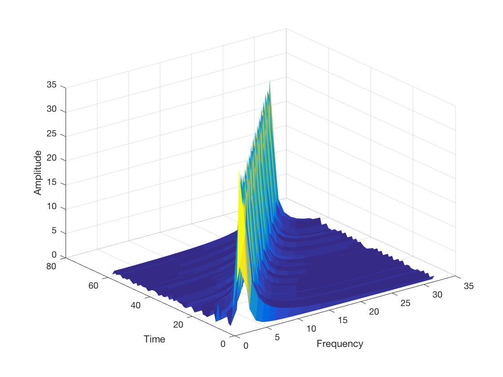
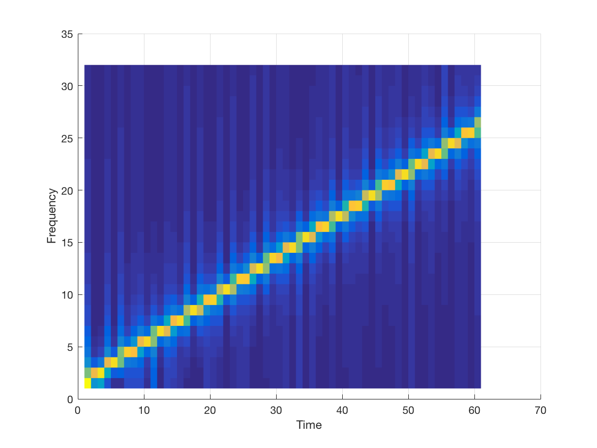
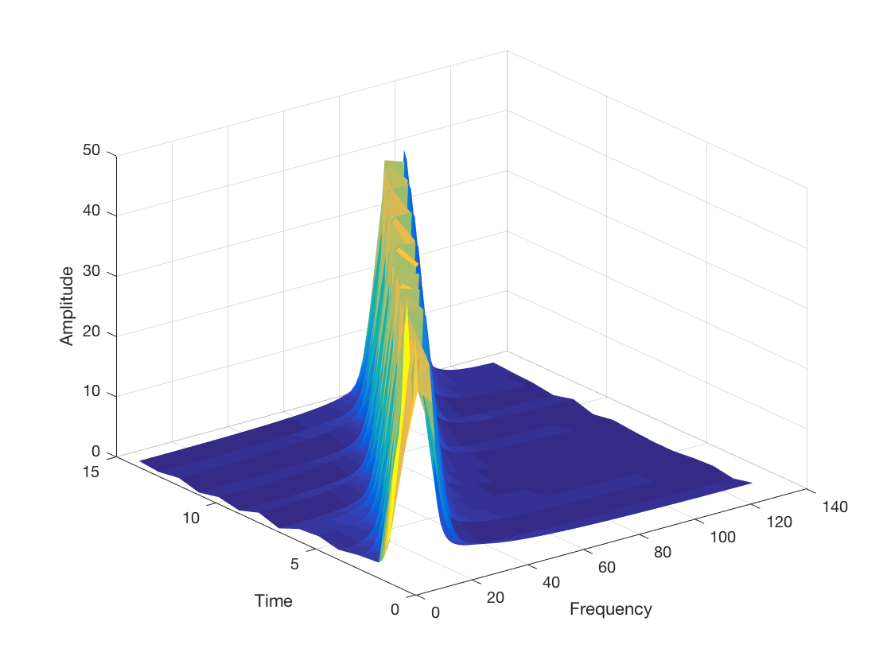
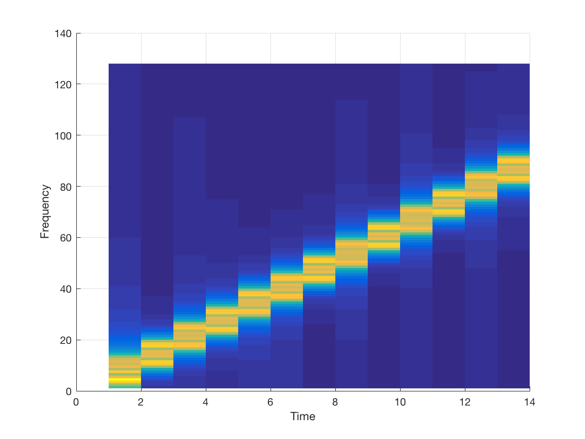
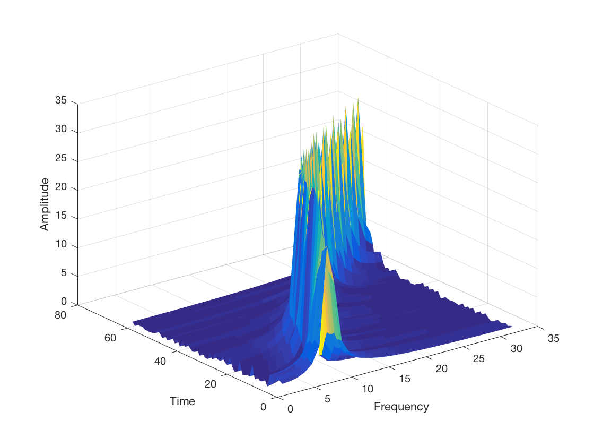
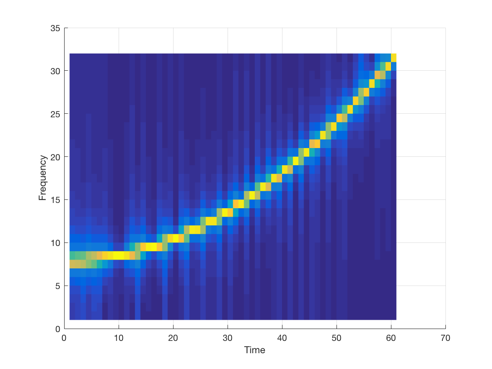
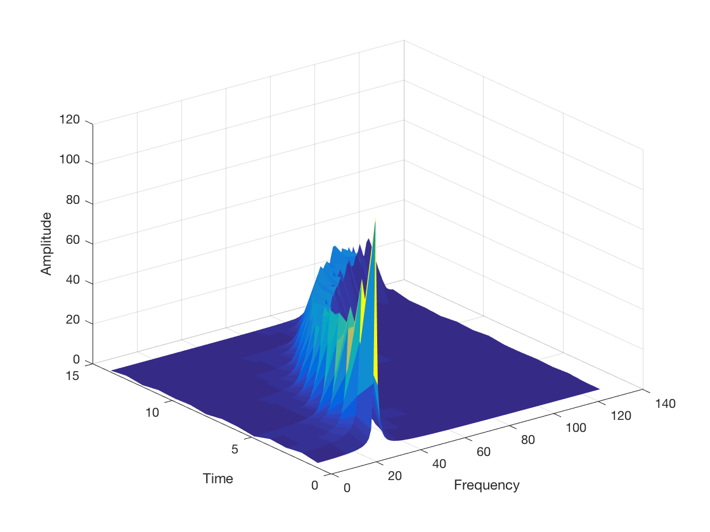
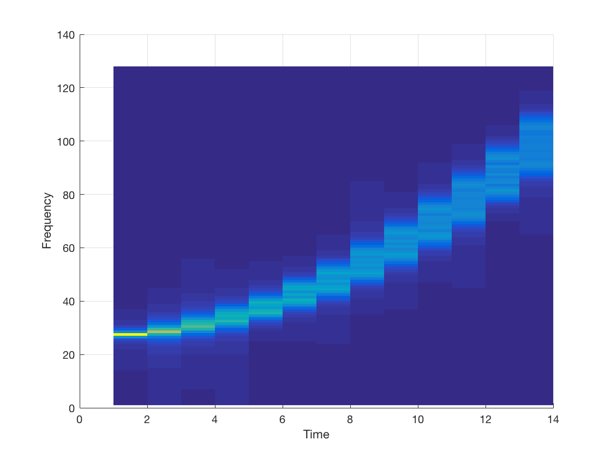

# Python implementation of fast rectangular short-time Fourier transform (Cooley-Tukey FFT)

## Signal with a linear increasing frequency

### Narrow window

### Wide window

## Signal with a quadratic increasing frequency

### Narrow window

### Wide window

